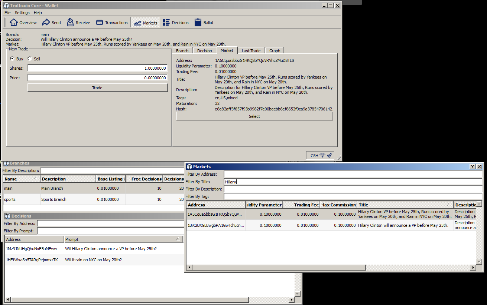

# Exe Files 

For those who use Windows and have almost no idea how to use GitHub.

## Install

1. Download the version appropriate for your windows system: 32-bit or 64-bit.
2. Verify the file's integrity (below).
3. Doubleclick.

## Verifying
Truthcoin should 'hash' to the following values. If you don't know what that means, you could either [1] ignore it and hope for the best, [2] google about file hashes, or [3] download the free [HashTab](http://implbits.com/products/hashtab/) and use "rightclick > properties" on the file you downloaded.

**truthcoin-0.10.99rc7-win64-setup.exe**  

MD5     : 9A00E718DBD2FD6CA41AB763A6A9A38D
SHA-1   : 02201B43FBCC7A41E84CCE9D4D22EF8347C967C0
SHA-256 : A8F2EC7CFB719FA22EA7211AAB1F74FF86699B6C5C2F3C2A6F485D88BECE55DF

**truthcoin-0.10.99rc7-win32-setup**  

MD5     : 5A25DF5446F5A155BA0F535928EC166C
SHA-1   : 87AF3352A7AFDF3EBC5EA2A8D927A575DC549E00
SHA-256 : 1FACC044A1240558822D955D839200C08CAD7CD814DE736417C25F8B415E8CED

