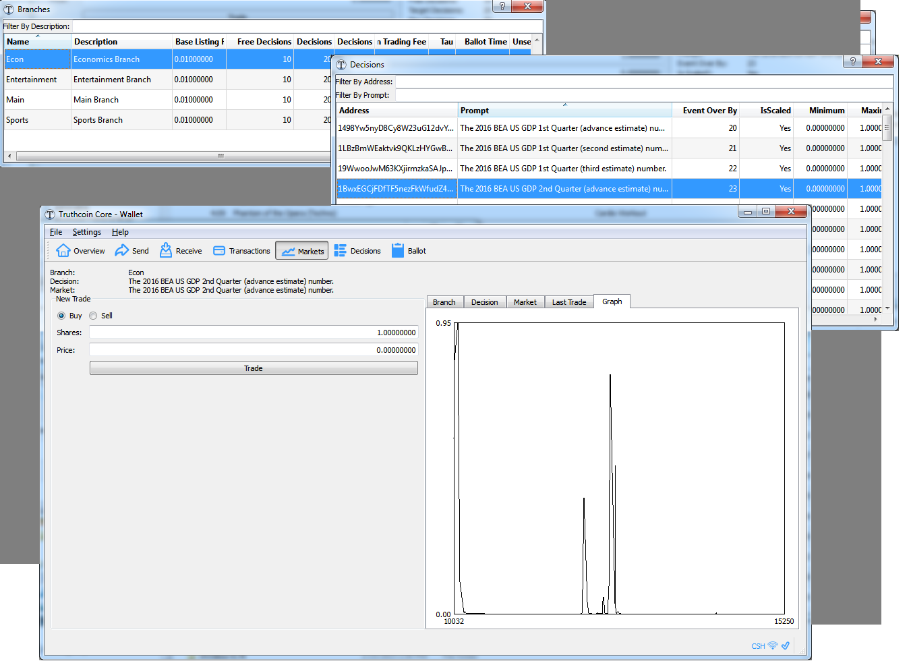

# Exe Files 

For those who use Windows and have almost no idea how to use GitHub.

Latest files will always be at [the dev site](https://dev.truthcoin.info/).

## Install

1. Download the version appropriate for your windows system: 32-bit or 64-bit.
2. Verify the file's integrity (below).
3. Doubleclick.

## Verifying
Truthcoin should 'hash' to the following values. If you don't know what that means, you could either [1] ignore it and hope for the best, [2] google about file hashes, or [3] download the free [HashTab](http://implbits.com/products/hashtab/) and use "rightclick > properties" on the file you downloaded.

**truthcoin-0.10.99rc9-win64-setup.exe**  

MD5     : 1ABE17416771AFCB308A846A0793A64E
SHA-1   : 274EA4FD57C88EC2F73DE229C38112C51F71ED94
SHA-256 : B8AACE63418738AEAD71C1DF63051285028C36B2517D29816BF8C64ABFB8BBFE

**truthcoin-0.10.99rc9-win32-setup.exe**  

MD5     : 8364325C942F0AE8B0251B2C5F0BFF5F
SHA-1   : EFDE735192B32962F70BF28D7783EAC0550D66D4
SHA-256 : AFFED822E9A12437D52313E81C4D3BC1C71B23B0C2BC24257DFA8F58740D5D5F

